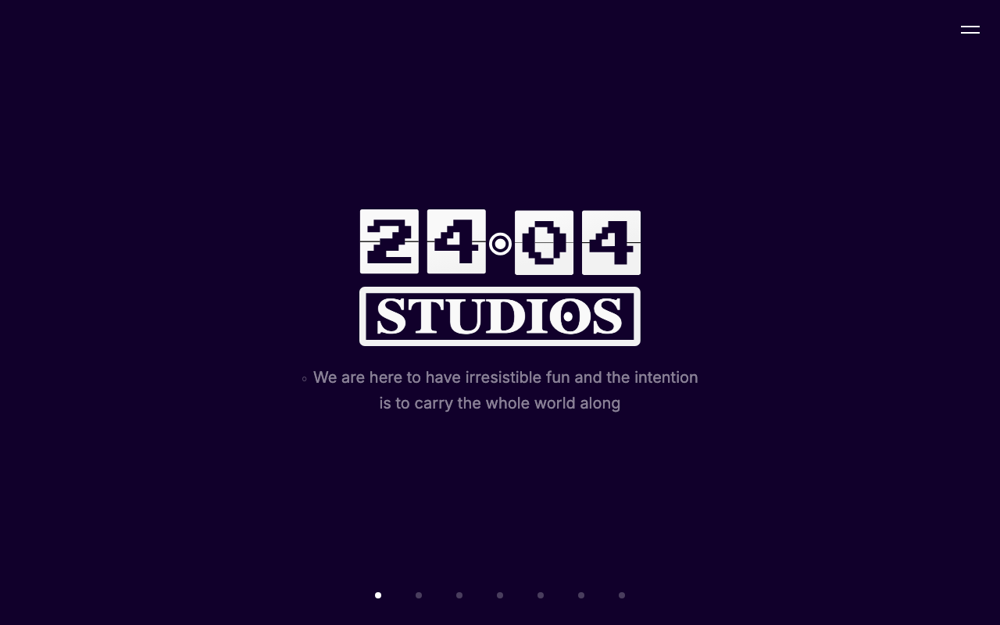

# 2404 Studios: Interactive Landing Page

The official landing page for 2404 Studios, a game development collective building worlds worth playing.

[](https://react.dev/)
[](https://vite.dev/)
[](https://tailwindcss.com/)
[](LICENSE)



---

## What Is This?

A fullscreen, card-stack landing page for 2404 Studios. Visitors navigate vertically through seven sections using keyboard (WASD/Arrow keys) or touch swipe. Each section slides in with a stacking card animation.

---

## Features

- **Card stack navigation**: Seven fullscreen pages with CSS transform-based stacking animations
- **Keyboard and swipe input**: Navigate with Arrow keys, WASD, or vertical swipe gestures
- **Horizontal video reels**: Scroll-snap containers for showcasing game footage, with lazy-loaded autoplay
- **Fullscreen menu overlay**: Hamburger menu with direct page jumps, closes on Escape or backdrop tap
- **Mobile-first**: 100dvh viewport, 44px touch targets, iOS Safari overscroll prevention
- **Transition guard**: Race-condition-safe navigation with ref-based locking

---

## Tech Stack

| Layer | Technology |
|-------|-----------|
| Framework | React 19 |
| Bundler | Vite 8 |
| Styling | Tailwind CSS 4 |
| Animations | CSS transforms + transitions |
| Fonts | Press Start 2P (logo), Inter (body) |

---

## Running Locally

```bash
git clone https://github.com/ajanaku1/2404Studios.git
cd 2404Studios
npm install
npm run dev
```

Open `http://localhost:5173` in your browser.

---

## Project Structure

```
src/
  hooks/
    useNavigation.js       # Keyboard + swipe nav with transition guard
  components/
    CardStack.jsx          # Stacking card animation engine
    HamburgerButton.jsx    # Fixed menu toggle
    MenuOverlay.jsx        # Fullscreen nav overlay
    ReelsContainer.jsx     # Horizontal scroll-snap video container
  pages/
    HeroPage.jsx           # Logo + tagline
    ExperiencePage.jsx     # Video reel showcase
    AboutPage.jsx          # Mission statement
    JoinPage.jsx           # Email signup form
    SocialPage.jsx         # Discord, Instagram, X links
    ThankYouPage.jsx       # Closing card
    LogoPage.jsx           # Brand mark
  App.jsx                  # Root wiring
  index.css                # Tailwind + transition utilities
public/
  logo.svg                 # Official 2404 Studios logo
  favicon.svg              # Browser tab icon
```

---

## License

MIT
